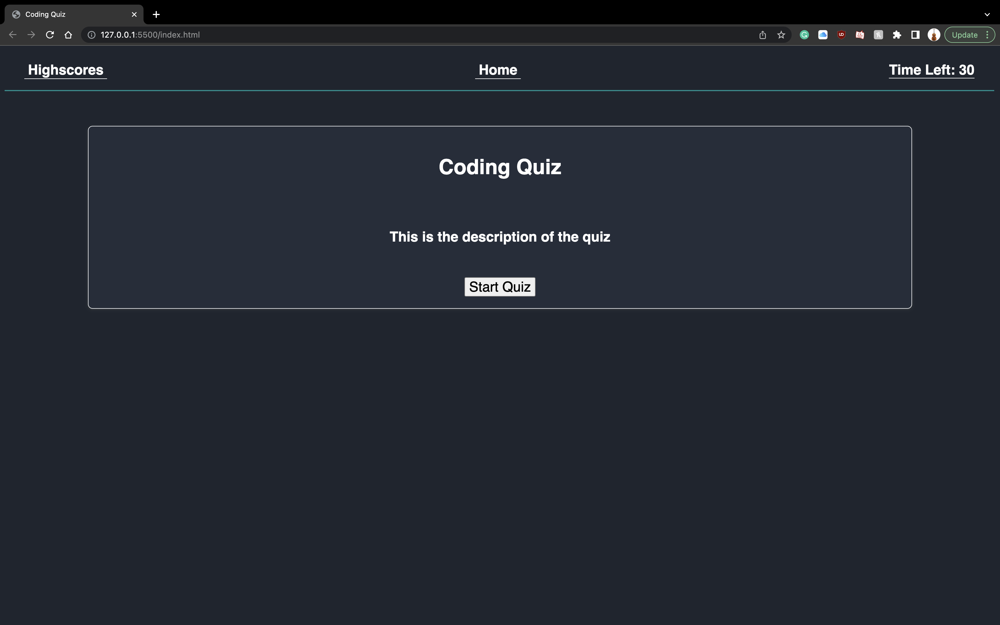

# Code Quiz

  ## Description

  What was my motivation?
  - The motivation behind this project was to create an interactive quiz with the use of local storage.

  Why did I build this project?
  - I built this project to get a better understand of how to opperate multiple functions in tandom and save to the localstorage

  What problem does it solve?
  - This solves the problem of boredom.

  What did I learn?
  - I learned how to create a timer, score list, the use of localstorage, and how to call functions for different functions.
  

  ## Table of Contents

  - [Installation](#installation)
  - [Usage](#usage)
  - [Contributing](#contributing)
  - [Tests](#tests)
  - [Questions](#questions)
  - [License](#license)

  ## Installation

  Just click on the link down below in the README to launch the project.

  ## Usage

  Link: 

  
  

  ## Contributing

  No collaborators in this project.

  ## Tests

  No tests are applicable for this project.

  ## Questions

  Github Profile: josephpicardat

  If you need to reach me, you can with through my email: josephpicardat1@gmail.com

  ## License

  
  (https://opensource.org/licenses/MIT)

  Copyright 2022 Joseph Picardat

  Permission is hereby granted, free of charge, to any person obtaining a copy of this software and associated documentation files (the "Software"), to deal in the Software without restriction, including without limitation the rights to use, copy, modify, merge, publish, distribute, sublicense, and/or sell copies of the Software, and to permit persons to whom the Software is furnished to do so, subject to the following conditions:

    The above copyright notice and this permission notice shall be included in all copies or substantial portions of the Software.
    
    THE SOFTWARE IS PROVIDED "AS IS", WITHOUT WARRANTY OF ANY KIND, EXPRESS OR IMPLIED, INCLUDING BUT NOT LIMITED TO THE WARRANTIES OF MERCHANTABILITY, FITNESS FOR A PARTICULAR PURPOSE AND NONINFRINGEMENT. IN NO EVENT SHALL THE AUTHORS OR COPYRIGHT HOLDERS BE LIABLE FOR ANY CLAIM, DAMAGES OR OTHER LIABILITY, WHETHER IN AN ACTION OF CONTRACT, TORT OR OTHERWISE, ARISING FROM, OUT OF OR IN CONNECTION WITH THE SOFTWARE OR THE USE OR OTHER DEALINGS IN THE SOFTWARE.

